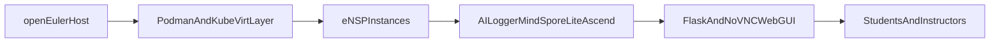

# AIDEN Lab Architecture

## High-level topology

## Component chain

- **openEuler host:** stable Linux base, package management via `dnf`, and kernel/network primitives for Kubernetes workloads.
- **Podman/KubeVirt containers:** isolation and VM lifecycle management for repeatable lab instances.
- **eNSP instances:** practical Huawei-style topology and device-configuration environment.
- **AI Logger (MindSpore Lite on Ascend):** parses CLI and service logs, detects probable root causes, and emits guided fixes.
- **Flask/noVNC GUI:** browser-based entry point for remote access, observability, and troubleshooting.

## Why this architecture works

- Supports low-cost single-node deployment for institutions with constrained budgets.
- Scales horizontally in cloud mode for larger classes and concurrent cohorts.
- Separates lab compute from AI diagnostics so troubleshooting can evolve independently.
