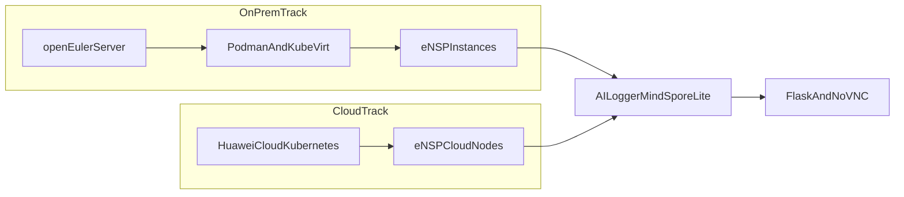

<section className="aiden-home">
  

    <h1>Build Better Networks. Guided by AI.</h1>
    

      AIDEN Lab is an AI-driven elastic network laboratory for ICT training teams,
      university labs, and instructors who need practical networking practice without
      hardware bottlenecks.
    

    Ready for Huawei ICT Academy
    

      <strong>Project mission:</strong> deliver resilient, scalable labs where learners can deploy topologies,
      troubleshoot failures, and understand AI-assisted operations in realistic environments.
    

  

  

    <article className="aiden-panel">
      <h3>No Server? No Problem.</h3>
      

        Access high-performance eNSP environments directly from your browser with guided simulation.
      

    </article>
    <article className="aiden-panel aiden-panel--teal">
      <h3>Elastic By Design</h3>
      

        Start on a single node and scale to cloud-based cohorts with one consistent operational model.
      

    </article>
  

</section>

## Architecture at a glance

Hybrid flow:

1. openEuler host provides a hardened base.
2. Podman and KubeVirt run isolated lab workloads.
3. eNSP instances host practical network scenarios.
4. AI Logger (MindSpore Lite on Ascend) inspects logs and flags faults.
5. Flask/noVNC web GUI exposes remote operation and troubleshooting.

## Start here

  <ul>
    <li><a href="/docs/architecture">Architecture</a></li>
    <li><a href="/docs/deployment-options">Deployment Options</a></li>
    <li><a href="/docs/ai-assistant-ensp-logger">AI Assistant - ENSP Logger System</a></li>
    <li><a href="/docs/installation-quick-start">Installation &amp; Quick Start</a></li>
    <li><a href="/docs/training-implementation-guide">Training &amp; Implementation Guide</a></li>
  </ul>

