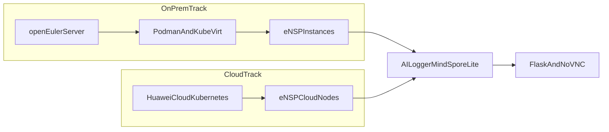

<section className="aiden-home">
  

    <h1>Build Better Networks. Guided by AI.</h1>
    

      AIDEN Lab is an AI-driven elastic networking lab for ICT academies, universities,
      and trainers who need hands-on eNSP practice without hardware bottlenecks.
    

    

      Ready for Huawei ICT Academy
      Cloud and On-Prem Tracks
    

    

      <strong>Mission:</strong> make practical network training scalable, reliable, and measurable by combining
      virtual labs with AI-assisted troubleshooting workflows.
    

    

      <a href="/docs/installation-quick-start" className="hero-btn hero-btn--primary">
        Launch Quick Start
      </a>
      <a href="/docs/architecture" className="hero-btn hero-btn--ghost">
        Explore Architecture
      </a>
    

  

  

    <article className="aiden-panel">
      <h3>No Server? No Problem</h3>
      

        Access high-performance eNSP environments through browser-delivered sessions with guided labs.
      

    </article>
    <article className="aiden-panel aiden-panel--teal">
      <h3>Elastic By Design</h3>
      

        Start with one node and scale to full cohorts while keeping one consistent operational model.
      

    </article>
    <article className="aiden-panel">
      <h3>AI-Assisted Fault Isolation</h3>
      

        Analyze logs, detect anomalies, and guide learners toward root-cause analysis using the AI logger flow.
      

    </article>
  

</section>

## Why teams use AIDEN Lab

  <article className="aiden-doc-card">
    <h3>Instructor-first workflows</h3>
    

      Provision labs quickly, monitor learner progress, and run repeatable training cycles for each cohort.
    

  </article>
  <article className="aiden-doc-card">
    <h3>Hybrid deployment support</h3>
    

      Run fully on-prem, fully in cloud, or with hybrid fallback based on your infrastructure constraints.
    

  </article>
  <article className="aiden-doc-card">
    <h3>Competition-ready scenarios</h3>
    

      Build realistic network cases aligned with Huawei ICT training and competition style environments.
    

  </article>
  <article className="aiden-doc-card">
    <h3>Lower operational overhead</h3>
    

      Reduce hardware pressure while maintaining practical depth with virtualized and AI-observable labs.
    

  </article>

## Architecture at a glance

Hybrid flow:

1. openEuler host provides a hardened base.
2. Podman and KubeVirt run isolated lab workloads.
3. eNSP instances host practical network scenarios.
4. AI Logger (MindSpore Lite on Ascend) inspects logs and flags faults.
5. Flask/noVNC web GUI exposes remote operation and troubleshooting.

## Start here

  <ul>
    <li><a href="/docs/installation-quick-start">Installation and Quick Start</a></li>
    <li><a href="/docs/architecture">Architecture</a></li>
    <li><a href="/docs/deployment-options">Deployment Options</a></li>
    <li><a href="/docs/setup-scripts">Setup Scripts</a></li>
    <li><a href="/docs/ai-assistant-ensp-logger">AI Assistant and ENSP Logger</a></li>
    <li><a href="/docs/training-implementation-guide">Training and Implementation Guide</a></li>
  </ul>

